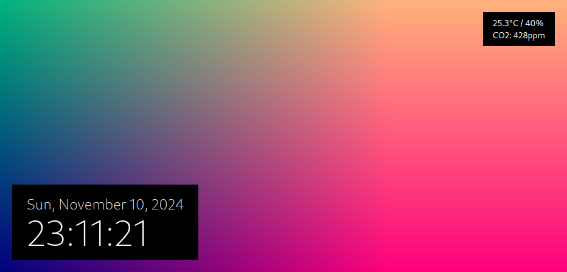

# clockwork
An application that displays a clock and a customizable GLSL-rendered background.



## Requirements
- Node.js
- Docker (optional)
    - If you use code-server to edit frag file, you must install Docker.

## Development
```sh
$ npm install
$ cp src/shaders/main.example.frag src/shaders/main.frag
$ cp src/config.example.ts src/config.ts
$ npm run dev
```

## License
[The MIT License](./LICENSE).

## Author
Masayoshi Wada <developer@andantesoftware.com>
